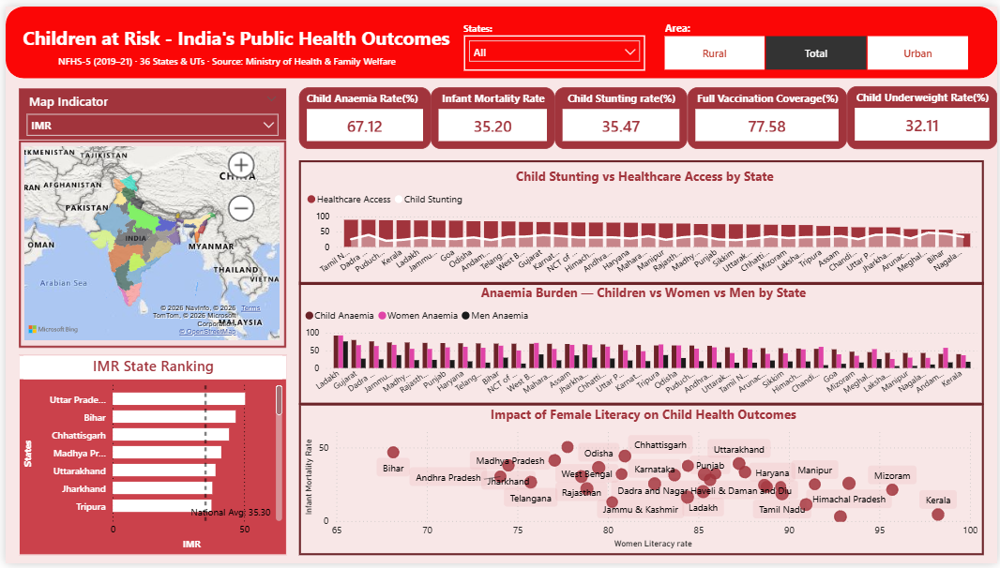

# India Public Health Outcomes Analysis — NFHS-5


> A state-level public health analysis across 36 Indian states and UTs using NFHS-5 
> (2019–21) data — covering mortality, child nutrition, disease burden, and healthcare 
> access indicators, visualised in an interactive Power BI dashboard.

---

## Dashboard Preview



---

## Project Structure
india-health-analysis/
│
├── data/
│   ├── raw/                         
│   │   ├── NFHS_5_Factsheets_Data.xls
│   │   ├── Kaggledatafile.csv
│   │   └── Sample_reg_2020.csv
│   └── cleaned/                     
│       ├── NFHS_5_cleaned.xlsx
│       ├── NFHS_5_cleaned.csv
│       ├── kaggle_district_cleaned.csv
│       └── SRS_2020_cleaned.csv
│
├── notebooks/
│   ├── 01_data_cleaning.ipynb        
│   └── 02_eda_visualisations.ipynb   
│
├── sql/
│   ├── 01_mortality_analysis.sql     
│   ├── 02_nutrition_analysis.sql     
│   ├── 03_disease_burden.sql         
│   └── 04_healthcare_access.sql      
│
├── powerbi/
│   └── india_health_dashboard.pbix   
│
├── assets/                           
│   ├── 01_IMR_top_bottom.png
│   ├── 02_urban_rural_IMR_gap.png
│   ├── 03_malnutrition_comparison.png
│   ├── 04_literacy_vs_stunting.png
│   ├── 05_anaemia_burden.png
│   ├── 06_healthcare_access_score.png
│   ├── 07_correlation_heatmap.png
│   └── dashboard_preview.png
│
└── README.md

---

## Key Analytical Questions Answered

1. Which Indian states have the highest and lowest infant mortality rates?
2. Is there a correlation between women's literacy and child malnutrition?
3. How does anaemia burden differ between urban and rural populations?
4. Which states have the lowest healthcare access despite high disease burden?
5. What is the relationship between total fertility rate and infant mortality?
6. How does diabetes and hypertension prevalence vary across Indian states?
7. Which states carry a triple burden — high stunting, wasting, and underweight simultaneously?
8. Where is the urban-rural divide in healthcare access most severe?

---

## Data Sources

| Dataset | Source | Coverage |
|---|---|---|
| NFHS-5 State Factsheets | [data.gov.in](https://data.gov.in) | 36 states/UTs · 136 indicators · 2019–21 |
| NFHS-5 District Data | [Kaggle](https://kaggle.com) | 706 districts · 109 indicators |
| SRS Infant Mortality 2020 | [data.gov.in](https://data.gov.in) | State-wise IMR · 2020 |

---

## 🛠️ Tools & Their Roles

| Tool | Role |
|---|---|
| **Excel** | Data cleaning — column selection, null handling, state name standardisation |
| **Python (pandas, matplotlib, seaborn)** | Data cleaning automation, EDA, correlation heatmaps, distribution charts |
| **MySQL** | State aggregations, rankings, urban vs rural comparisons, cross-module joins |
| **Power BI** | Interactive dashboard — India choropleth map, slicers, KPI cards, 9 chart types |

---

## Analysis Modules

### Module 1 — Mortality & Fertility
- Infant, neonatal, and under-5 mortality rates across all 36 states
- Urban vs rural IMR gap — Chhattisgarh worst at 22.5, Kerala best at 1.7
- TFR vs IMR correlation — high fertility states consistently show high mortality
- Cross-validation between NFHS-5 and SRS 2020 estimates

### Module 2 — Child Nutrition
- Stunting, wasting, and underweight prevalence across states
- Triple burden analysis — 4 states exceed national average on all 3 indicators
- Women's literacy vs child stunting correlation with outlier identification
- Urban vs rural stunting gap — Jharkhand worst at 15.5 percentage points

### Module 3 — Disease Burden
- Anaemia prevalence in children (67.1%), women (57%), and men (25%)
- Urban vs rural diabetes gap — urban consistently 2.5% higher nationwide
- Hypertension gender gap — men consistently more affected across all states
- Double burden states — fighting both anaemia and lifestyle diseases simultaneously
- Tobacco and alcohol use patterns across states

### Module 4 — Healthcare Access
- Institutional birth rates — Kerala 99.76% vs Nagaland 45.67%
- Full vaccination coverage — Dadra & Nagar Haveli top at 94.88%
- ANC dropout gap — Jharkhand worst at 29.4 percentage points
- Composite healthcare access score across 4 sub-metrics using ribbon chart

---

## Key Findings

- **National IMR is 35.3** — Uttar Pradesh at 50.4 is nearly 4× worse than Puducherry at 2.9
- **Chhattisgarh** has the worst urban-rural IMR gap of 22.5 per 1000 live births
- **Meghalaya** has the highest child stunting at 46.54% despite 88% women's literacy — breaking the expected pattern
- **Bihar** is the only state where stunting, wasting, and underweight all exceed 40% simultaneously
- **Ladakh** has 92.46% child anaemia — the highest in the country
- **Kerala paradox** — best health outcomes overall despite not topping every individual access metric
- **Nagaland** ranks bottom consistently across every single module — vaccination, births, ANC, nutrition, and mortality
- **5 states** carry a double burden — high anaemia and rising diabetes simultaneously — Gujarat, Punjab, Telangana, NCT of Delhi, West Bengal
- **Urban diabetes** is 2.5% higher than rural nationally — confirming urbanisation drives lifestyle disease burden

---

## EDA Visualisations

| Chart | Insight |
|---|---|
| IMR top & bottom states | 4× gap between best and worst performing states |
| Urban vs rural IMR gap | Chhattisgarh rural IMR nearly double its urban |
| Child malnutrition comparison | Bihar triple burden clearly visible |
| Literacy vs stunting scatter | Negative trend with Gujarat & Meghalaya as outliers |
| Anaemia burden | Children and women disproportionately affected vs men |
| Healthcare access score | Tamil Nadu most consistent · Nagaland consistently worst |
| Correlation heatmap | Strong IMR-TFR link · literacy negatively correlated with mortality |

---

## How to Run

**Prerequisites**
- Python 3.x with Jupyter Notebook or VS Code
- MySQL Server + MySQL Workbench
- Power BI Desktop (free)
- Microsoft Excel

```bash
pip install pandas matplotlib seaborn openpyxl xlrd sqlalchemy pymysql cryptography
```

**Steps**
1. Clone this repository
```bash
git clone https://github.com/Suhani-Gupta-27/india-health-analysis.git
```
2. Run `notebooks/01_data_cleaning.ipynb` to reproduce cleaned data
3. Import cleaned CSVs into MySQL using `notebooks/01_data_cleaning.ipynb` connection cell
4. Run SQL files from `sql/` folder in MySQL Workbench in order 01→04
5. Run `notebooks/02_eda_visualisations.ipynb` to reproduce all EDA charts
6. Open `powerbi/india_health_dashboard.pbix` in Power BI Desktop

---

## Data Notes

- `*` values in NFHS-5 indicate suppressed data due to small sample size — treated as null
- Negative IMR values for small UTs (Andaman, Goa, Dadra) replaced with null during cleaning
- State names standardised between NFHS-5 and SRS 2020 for accurate joining
- IMR data available for 22 of 36 states in NFHS-5 — remaining UTs have suppressed values
- Population estimates used for absolute number calculations based on Census 2021 projections

---


